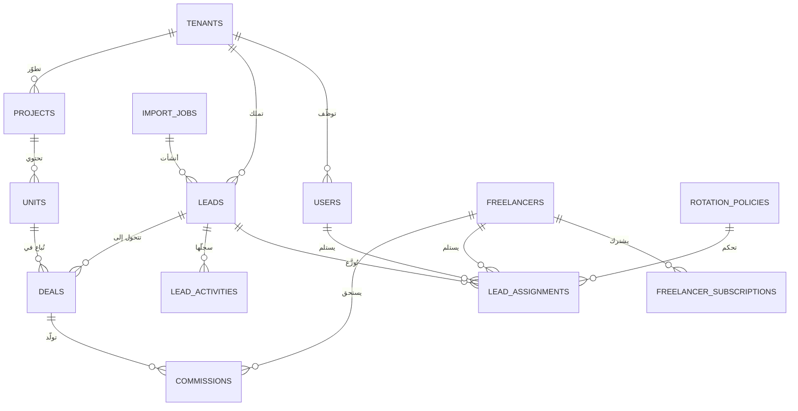

# الهيكلة الكاملة لنظام CRM عقاري متعدد البوابات (SaaS + PropTech + Affiliate)

> وثيقة معمارية تقنية ومنتجية لنظام CRM مركزي تديره وكالة تسويق واحدة (Master Agency)
> لخدمة أكثر من 90 شركة عقارية في نفس الوقت، بعزل تام للبيانات، وواجهتين مختلفتين،
> ومساعد ذكاء اصطناعي لإدخال البيانات وتوزيع الليدز.

---

## 1. الرؤية المعمارية العامة

النظام مبني على مبدأ واحد حاسم: **مستأجر واحد (Tenant) = شركة واحدة = جدار عزل كامل**.
الوكالة (Master) تقف فوق كل المستأجرين وترى كل شيء، وكل شركة لا ترى إلا نفسها.

```
┌─────────────────────────────────────────────────────────────┐
│                     Master Portal (الوكالة)                  │
│   إدارة الشركات · رفع الشيتات بالـ AI · التوزيع · التقارير   │
└──────────────┬──────────────┬──────────────┬────────────────┘
               │              │              │
        ┌──────▼─────┐ ┌──────▼─────┐ ┌──────▼─────┐
        │ Sub-portal │ │ Sub-portal │ │ Sub-portal │  ... ×90+
        │  شركة (أ)  │ │  شركة (ب)  │ │  شركة (ج)  │
        │ مبيعاتها   │ │ مبيعاتها   │ │ مبيعاتها   │
        │ وليدزها    │ │ وليدزها    │ │ وليدزها    │
        └────────────┘ └────────────┘ └────────────┘
               ▲
        ┌──────┴──────────────────────────┐
        │  Freelance Network (المسوقون)    │
        │  اشتراك شهري أو عمولة عند البيع  │
        └─────────────────────────────────┘
```

### قرار العزل: صف واحد لكل بيانات + Row-Level Security

مع 90+ شركة، إنشاء قاعدة بيانات منفصلة لكل شركة كابوس تشغيلي. الحل الصناعي المجرَّب:

- **قاعدة بيانات واحدة (PostgreSQL)** وكل جدول فيه عمود `tenant_id`.
- **Row-Level Security (RLS)** على مستوى قاعدة البيانات نفسها: حتى لو أخطأ الكود،
  قاعدة البيانات ترفض إرجاع صف لا يخص المستأجر الحالي. العزل ليس "سلوك تطبيق" بل "قانون قاعدة بيانات".
- **JWT Claims**: كل جلسة دخول تحمل `tenant_id` و `role` داخل التوكن، وسياسات RLS تقرأها مباشرة.
- المستخدمون التابعون للوكالة يحملون claim خاص (`is_master = true`) يفتح لهم كل المستأجرين.

هذا يعطي عزلاً حقيقياً بتكلفة تشغيل شركة واحدة، ويتوسع لآلاف المستأجرين دون تغيير معماري.

---

## 2. هيكلة قاعدة البيانات (Database Schema)

### 2.1 خريطة الكيانات والعلاقات (ERD)



### 2.2 الجداول الأساسية (PostgreSQL)

#### أ) طبقة الهوية والعزل

```sql
-- الشركات / المستأجرون
create table tenants (
  id            uuid primary key default gen_random_uuid(),
  name          text not null,                -- اسم الشركة أو المطوّر
  slug          text unique not null,         -- عنوان البوابة الفرعية: crm.app/{slug}
  type          text not null default 'developer'
                check (type in ('developer','brokerage','agency_internal')),
  plan          text not null default 'standard',
  branding      jsonb default '{}',           -- شعار وألوان البوابة الفرعية
  is_active     boolean default true,
  created_at    timestamptz default now()
);

-- المستخدمون (فريق الوكالة + موظفو الشركات)
create table users (
  id            uuid primary key,             -- يطابق auth.users
  tenant_id     uuid references tenants(id),  -- NULL = مستخدم من الوكالة الأم
  role          text not null check (role in (
                  'master_admin',    -- إدارة الوكالة: كل شيء
                  'master_marketer', -- فريق التسويق: رفع وتوزيع وتحليل
                  'tenant_admin',    -- مدير الشركة: يرى شركته فقط
                  'sales_manager',   -- مدير مبيعات الشركة: يوزع داخلياً
                  'sales_agent'      -- موظف مبيعات: يرى ليدزه فقط
                )),
  full_name     text,
  phone         text,
  is_active     boolean default true,
  performance_score numeric default 50,       -- يغذّيه محرك الـ AI (0–100)
  created_at    timestamptz default now()
);
```

#### ب) طبقة الليدز والتوزيع

```sql
-- العملاء المحتملون
create table leads (
  id            uuid primary key default gen_random_uuid(),
  tenant_id     uuid not null references tenants(id),
  import_job_id uuid references import_jobs(id),   -- من أي شيت جاء
  full_name     text not null,
  phone         text not null,
  email         text,
  source        text,                              -- Facebook, Google, Landing...
  campaign      text,                              -- اسم الحملة الإعلانية
  budget_min    numeric,
  budget_max    numeric,
  interest      jsonb default '{}',                -- منطقة، نوع وحدة، غرض الشراء
  quality_score numeric,                           -- تقييم الـ AI لجودة الليد (0–100)
  stage         text not null default 'new' check (stage in (
                  'new','assigned','contacted','qualified',
                  'negotiation','won','lost','recycled')),
  is_duplicate  boolean default false,
  created_at    timestamptz default now(),
  -- منع تكرار نفس الرقم داخل نفس الشركة
  unique (tenant_id, phone)
);
create index on leads (tenant_id, stage);
create index on leads (tenant_id, quality_score desc);

-- سياسات التوزيع (يضبطها مدير التسويق أو مدير المبيعات)
create table rotation_policies (
  id               uuid primary key default gen_random_uuid(),
  tenant_id        uuid not null references tenants(id),
  name             text not null,
  mode             text not null default 'round_robin' check (mode in (
                     'round_robin',   -- بالتساوي بالدور
                     'weighted',      -- حسب وزن/أداء الموظف
                     'ai_recommended' -- الـ AI يرشّح الأنسب لكل ليد
                   )),
  max_per_agent    int default 10,        -- الحد الأقصى لكل موظف في الدورة
  sla_minutes      int default 30,        -- مدة الاستجابة قبل سحب الليد
  recycle_enabled  boolean default true,  -- إعادة تدوير الليد المهمل تلقائياً
  active_hours     jsonb,                 -- ساعات العمل المسموح التوزيع فيها
  is_active        boolean default true
);

-- سجل إسناد الليدز (Assignment = من استلم، متى، وماذا حدث)
create table lead_assignments (
  id            uuid primary key default gen_random_uuid(),
  tenant_id     uuid not null references tenants(id),
  lead_id       uuid not null references leads(id),
  assignee_type text not null check (assignee_type in ('sales_agent','freelancer')),
  assignee_id   uuid not null,              -- users.id أو freelancers.id
  policy_id     uuid references rotation_policies(id),
  assigned_by   text default 'auto',        -- auto | manual | ai
  ai_reason     text,                       -- لماذا رشّح الـ AI هذا الموظف
  status        text default 'active' check (status in
                  ('active','expired','recycled','completed')),
  assigned_at   timestamptz default now(),
  expires_at    timestamptz                 -- بعده يُعاد الليد للتوزيع
);

-- سجل النشاط على الليد (مكالمات، ملاحظات، تغيير مرحلة)
create table lead_activities (
  id            uuid primary key default gen_random_uuid(),
  tenant_id     uuid not null references tenants(id),
  lead_id       uuid not null references leads(id),
  user_id       uuid references users(id),
  type          text not null,              -- call, whatsapp, note, stage_change...
  payload       jsonb default '{}',
  created_at    timestamptz default now()
);
```

#### ج) طبقة المخزون العقاري (Developer Supermarket)

```sql
-- المشاريع العقارية
create table projects (
  id            uuid primary key default gen_random_uuid(),
  tenant_id     uuid not null references tenants(id),  -- المطوّر المالك
  name          text not null,
  location      text,
  geo           jsonb,                       -- إحداثيات + منطقة
  delivery_date date,
  payment_plans jsonb default '[]',          -- خطط السداد
  media         jsonb default '[]',          -- صور، بروشور، فيديو
  is_published  boolean default false,       -- ظاهر في السوبر ماركت؟
  visibility    text default 'network' check (visibility in
                  ('private','network','public'))
                -- private: للشركة فقط · network: لكل بائعي المنصة · public: للجميع
);

-- الوحدات
create table units (
  id            uuid primary key default gen_random_uuid(),
  tenant_id     uuid not null references tenants(id),
  project_id    uuid not null references projects(id),
  code          text not null,               -- كود الوحدة عند المطوّر
  type          text,                        -- شقة، فيلا، تجاري، إداري
  area_sqm      numeric,
  bedrooms      int,
  floor         int,
  price         numeric not null,
  status        text default 'available' check (status in
                  ('available','reserved','sold','held')),
  attributes    jsonb default '{}',          -- فيو، تشطيب، اتجاه...
  updated_at    timestamptz default now(),
  unique (project_id, code)
);
create index on units (project_id, status, price);

-- الصفقات
create table deals (
  id            uuid primary key default gen_random_uuid(),
  tenant_id     uuid not null references tenants(id),
  lead_id       uuid not null references leads(id),
  unit_id       uuid references units(id),
  closed_by_type text check (closed_by_type in ('sales_agent','freelancer')),
  closed_by_id  uuid,
  amount        numeric not null,
  status        text default 'reservation' check (status in
                  ('reservation','contracted','cancelled','completed')),
  closed_at     timestamptz default now()
);
```

#### د) طبقة المسوقين المستقلين والعمولات

```sql
-- المسوقون المستقلون (كيان مستقل عن users لأنهم يعملون عبر الشركات كلها)
create table freelancers (
  id             uuid primary key default gen_random_uuid(),
  auth_user_id   uuid unique,                -- حساب الدخول
  full_name      text not null,
  phone          text unique not null,
  model          text not null check (model in (
                   'subscription',   -- يدفع شهرياً ويستلم ليدز
                   'commission_only' -- مجاناً، يقبض عمولة عند الإغلاق
                 )),
  tier           text default 'bronze',      -- ترقية حسب الأداء
  performance_score numeric default 50,
  is_verified    boolean default false,      -- توثيق الهوية قبل استلام ليدز
  is_active      boolean default true,
  created_at     timestamptz default now()
);

-- اشتراكات المسوقين
create table freelancer_subscriptions (
  id             uuid primary key default gen_random_uuid(),
  freelancer_id  uuid not null references freelancers(id),
  plan           text not null,              -- basic / pro / elite
  monthly_lead_quota int not null,           -- عدد الليدز الشهري المضمون
  price          numeric not null,
  status         text default 'active' check (status in
                   ('active','past_due','cancelled')),
  period_start   date not null,
  period_end     date not null
);

-- العمولات
create table commissions (
  id             uuid primary key default gen_random_uuid(),
  deal_id        uuid not null references deals(id),
  beneficiary_type text not null check (beneficiary_type in
                   ('freelancer','sales_agent','agency')),
  beneficiary_id uuid,
  rate           numeric not null,           -- النسبة المتفق عليها
  amount         numeric not null,           -- الناتج المحسوب
  status         text default 'pending' check (status in
                   ('pending','approved','paid','disputed')),
  created_at     timestamptz default now()
);
```

#### هـ) طبقة الإدخال بالذكاء الاصطناعي

```sql
-- مهام رفع الشيتات عبر المساعد الذكي
create table import_jobs (
  id             uuid primary key default gen_random_uuid(),
  tenant_id      uuid not null references tenants(id), -- الشركة المستهدفة
  uploaded_by    uuid not null references users(id),
  file_url       text not null,
  original_name  text,
  chat_context   jsonb,          -- الأمر النصي الذي كتبه المسوّق
  column_mapping jsonb,          -- كيف فسّر الـ AI أعمدة الشيت
  stats          jsonb,          -- {total, inserted, duplicates, invalid}
  status         text default 'pending' check (status in
                   ('pending','mapping_review','processing','done','failed')),
  created_at     timestamptz default now()
);
```

### 2.3 قانون العزل (RLS Policies) — القلب الأمني

```sql
alter table leads enable row level security;

-- الشركة ترى ليدزها فقط
create policy tenant_isolation on leads
  using (tenant_id = (auth.jwt() ->> 'tenant_id')::uuid);

-- الوكالة الأم ترى الجميع
create policy master_full_access on leads
  using ((auth.jwt() ->> 'is_master')::boolean = true);

-- موظف المبيعات يرى الليدز المسندة إليه فقط
create policy agent_own_leads on leads for select
  using (id in (
    select lead_id from lead_assignments
    where assignee_id = auth.uid() and status = 'active'
  ));
```

نفس النمط يُطبَّق على كل جدول يحمل `tenant_id`. **لا يوجد أي مسار في الكود يتجاوز RLS**.

---

## 3. مسار المستخدم (User Flow)

### 3.1 مدير التسويق: رفع شيت ليدز عبر المساعد الذكي

**الشاشة:** واجهة محادثة نظيفة (نمط Claude) داخل الـ Master Portal — حقل كتابة، وزر مشبك للملفات.

| الخطوة | ما يفعله المستخدم | ما يفعله النظام |
|---|---|---|
| 1 | يسحب ملف Excel داخل المحادثة ويكتب: *«دي ليدز حملة فيسبوك بتاعة شركة النور، وزّعها على فريق مبيعاتهم، ٨ لكل موظف»* | يرفع الملف إلى تخزين مؤقت وينشئ `import_job` |
| 2 | — | الـ AI يقرأ أول 20 صفاً، يستنتج تلقائياً أن العمود A اسم والعمود C هاتف... ويحدد الشركة «النور» من نص الأمر |
| 3 | يرى **بطاقة معاينة** داخل المحادثة: خريطة الأعمدة + عدد الصفوف + «وُجد 14 رقماً مكرراً و3 أرقام غير صالحة» | ينتظر التأكيد — لا يُكتب شيء في قاعدة البيانات قبل الموافقة |
| 4 | يضغط **«تأكيد الاستيراد»** (أو يصحح: «العمود D ده الميزانية مش المصدر») | يُدخل الليدز باسم `tenant_id` الخاص بالنور، يحسب `quality_score` لكل ليد، ويشغّل سياسة التوزيع «8 لكل موظف» |
| 5 | يرى رسالة ختامية: *«تم استيراد 236 ليد ✓ · استُبعد 17 · وُزّعت على 6 موظفين · متوسط الجودة 72»* مع زر «عرض لوحة التوزيع» | يرسل إشعارات فورية لموظفي مبيعات النور |

**نقطة الجودة الحاسمة:** المعاينة قبل الكتابة. المسوّق لا يخاف أبداً أن «الشيت راح للشركة الغلط» — الاسم والشعار يظهران بوضوح في بطاقة التأكيد.

### 3.2 موظف المبيعات: استلام الليد والعمل عليه

| الخطوة | التجربة |
|---|---|
| 1 | إشعار (Push + داخل التطبيق): *«ليد جديد: أحمد م. — ميزانية 3–4 مليون — مهتم بالتجمع الخامس»* |
| 2 | يفتح لوحة **Kanban** بأعمدة المراحل (جديد → تم التواصل → مؤهل → تفاوض → إغلاق). الليد الجديد في أول عمود مع شارة عدّاد SLA: «تبقّى 27 دقيقة للتواصل» |
| 3 | يضغط على البطاقة: صفحة الليد بها الهاتف (زر اتصال/واتساب فوري)، مصدر الحملة، تقييم الجودة، وتوصية AI: *«اعرض عليه مشروع X — يطابق ميزانيته ومنطقته»* |
| 4 | بعد المكالمة يسحب البطاقة إلى «تم التواصل» ويكتب ملاحظة صوتية أو نصية — تُسجَّل في `lead_activities` |
| 5 | عند الجدية: يفتح **سوبر ماركت العقارات** من داخل صفحة الليد، يفلتر (السعر، المنطقة، عدد الغرف)، يختار وحدة، يضغط **«حجز»** → تتحول الوحدة إلى `reserved` وتُنشأ `deal` |
| 6 | لو تجاهل الليد حتى انتهاء الـ SLA: يُسحب تلقائياً ويُعاد توزيعه، وتنخفض نقطة أدائه — بلا تدخل يدوي |

### 3.3 المسوّق المستقل (Freelancer)

1. يسجّل ويوثّق هويته → يختار النموذج: **اشتراك شهري** (حصة ليدز مضمونة) أو **عمولة فقط**.
2. يستلم ليدز من الحصة العامة (ليدز لم تُخصَّص لشركة، أو فائض وافقت الوكالة على مشاركته).
3. يتصفح السوبر ماركت (المشاريع ذات `visibility = network`) ويبيع منها.
4. عند إغلاق صفقة: تُحسب العمولة تلقائياً في `commissions` ويتابع حالتها (معلقة → معتمدة → مدفوعة) من محفظته.
5. أداؤه يرفع تصنيفه (Bronze → Silver → Gold) فيحصل على ليدز أعلى جودة — حلقة تحفيز ذاتية.

### 3.4 مدير الشركة (Sub-portal)

يدخل على `crm.app/{slug}` بشعار شركته وألوانها، ويرى فقط: ليدز شركته، فريقه، مبيعاته، وتقارير أداء الحملات التي تديرها الوكالة له. **لا يعرف حتى بوجود شركات أخرى على النظام.**

---

## 4. محرك التوزيع الذكي (AI Lead Rotation) — التصميم الوظيفي

**مدخلات المحرك لكل ليد:**
- جودة الليد (`quality_score`): تُحسب من اكتمال البيانات، الميزانية، مصدر الحملة، وسلوك ليدز مشابهة تاريخياً.
- أداء الموظف (`performance_score`): معدل الرد داخل الـ SLA، معدل التحويل، متوسط قيمة الصفقات، الحمل الحالي.
- قيود السياسة: `max_per_agent`، ساعات العمل، مدة الدورة.

**أنماط التشغيل الثلاثة:**
1. **Round-robin**: عدالة كاملة — الافتراضي عند بدء أي شركة.
2. **Weighted**: الليدز عالية الجودة تميل للموظفين عالي الأداء (مع حد أدنى للجميع حتى لا يُحرم أحد).
3. **AI Recommended**: المحرك يرشّح ويشرح — *«رُشّح لكريم لأن معدل إغلاقه لليدز التجمع الخامس 22% مقابل متوسط 9%»* — والمدير يقبل بضغطة أو يعدّل. **الشفافية شرط**: كل توصية معها سبب مقروء (`ai_reason`).

**قاعدة ذهبية:** الـ AI يوصي والبشر يقررون في البداية. بعد أن تثبت التوصيات دقتها بالأرقام (Acceptance rate)، يفعّل المدير الوضع الأوتوماتيكي الكامل بنفسه.

---

## 5. فلسفة الواجهة (UI/UX)

- **لغة Notion البصرية**: خلفية بيضاء، خط واحد نظيف (مثل Inter + IBM Plex Sans Arabic)، ظلال خفيفة جداً، لا حدود صاخبة، أيقونات خطية رفيعة.
- **قانون الشاشة الواحدة**: أي شاشة تجيب على سؤال واحد فقط. لوحة الموظف = «على مين أرد دلوقتي؟». لوحة المدير = «الفلوس والليدز رايحة فين؟».
- **Kanban بالسحب والإفلات** هو مركز حياة موظف المبيعات — تغيير المرحلة بحركة إصبع، بلا نماذج ولا نوافذ منبثقة إلا للضرورة.
- **المحادثة بدل النماذج**: كل عملية معقدة (استيراد، توزيع، تقرير) تبدأ بجملة عربية طبيعية في المساعد الذكي بدل شاشة إعدادات بعشرين حقلاً.
- **RTL أصيل** من اليوم الأول، مع دعم إنجليزي كامل — وليس ترجمة لاحقة.
- **بوابة كل شركة بهويتها**: الشعار والألوان من `tenants.branding` — الشركة تشعر أن النظام «بتاعها».

---

## 6. الحزمة التقنية (Tech Stack)

| الطبقة | الاختيار | لماذا |
|---|---|---|
| Front-end | **Next.js 15 (React) + TypeScript + Tailwind CSS + shadcn/ui** | سرعة فائقة (Server Components)، مكتبة مكونات بجمالية Notion جاهزة، دعم RTL ممتاز |
| السحب والإفلات | **dnd-kit** | الأخف والأكثر مرونة للوحات Kanban |
| Back-end + DB | **Supabase (PostgreSQL + RLS + Auth + Realtime + Storage)** | RLS أصيل = العزل متعدد المستأجرين مبني في قلب المنصة، وRealtime جاهز لإشعارات الليدز الفورية |
| منطق الأعمال الثقيل | **Edge Functions (Deno/TypeScript)** + طوابير عبر **pg_cron / Queues** | معالجة الشيتات، محرك التوزيع، حساب العمولات |
| الذكاء الاصطناعي | **Claude API (Sonnet 5** للمحادثة وفهم الشيتات، **Haiku 4.5** للتقييم السريع للـ quality score) | أفضل فهم للعربية والأوامر الطبيعية + Tool Use لتنفيذ الاستيراد والتوزيع كأدوات مُحكمة |
| معالجة Excel | **SheetJS** داخل Edge Function | قراءة xlsx/csv بلا خادم إضافي |
| الدفع | **Stripe** (عالمي) + **Paymob** (مصر) | اشتراكات المسوقين والشركات |
| الاستضافة | **Vercel** (الواجهة) + Supabase Cloud | Zero-ops لفريق صغير |
| المراقبة | **Sentry + PostHog** | الأخطاء + سلوك المستخدمين لقياس «السهل الممتنع» فعلياً |

**لماذا هذا التوليف تحديداً؟** لأنه يعطي أقصى سرعة إطلاق بأقل فريق: العزل الأمني تتكفل به قاعدة البيانات، والواجهة الفورية تتكفل بها Realtime، والذكاء الاصطناعي يُستدعى كخدمة — فيتفرغ الفريق لمنطق الأعمال العقاري نفسه.

---

## 7. خارطة الطريق (Roadmap) — 4 مراحل

### المرحلة 1 — MVP «العمود الفقري» (أسابيع 1–6)
- المستأجرون + المستخدمون + الأدوار + RLS كاملة (تُختبر عدائياً من اليوم الأول).
- Master Portal: إنشاء شركة، رفع شيت **يدوي** (mapping بواجهة، بلا AI بعد)، عرض الليدز.
- Sub-portal: لوحة Kanban للمبيعات + صفحة الليد + الاتصال/واتساب + الملاحظات.
- توزيع Round-robin بسيط + SLA وإعادة التدوير.
- **معيار النجاح:** 3 شركات حقيقية تعمل يومياً بلا تسريب بيانات وبلا شكاوى من البطء.

### المرحلة 2 — «المساعد الذكي» (أسابيع 7–12)
- واجهة المحادثة + رفع Excel بالأوامر الطبيعية + بطاقة المعاينة والتأكيد.
- تقييم جودة الليدز (`quality_score`) آلياً عند الاستيراد.
- التوزيع الموزون (Weighted) + لوحة تحكم سياسات التوزيع للمديرين.
- تقارير أساسية لكل شركة (مصادر الليدز، معدلات التحويل، أداء الموظفين).
- **معيار النجاح:** 80% من الاستيرادات تتم عبر المحادثة بلا تدخل يدوي في الـ mapping.

### المرحلة 3 — «السوبر ماركت والتوصيات» (أسابيع 13–20)
- Developer Supermarket كاملاً: مشاريع، وحدات، فلترة فورية، حجز، صفقات.
- توصيات AI للتوزيع (`ai_recommended` مع الأسباب المقروءة) وتوصية «الوحدة المناسبة لهذا الليد».
- محرك العمولات: حساب تلقائي، حالات الاعتماد والدفع.
- التوسع إلى 30+ شركة + اختبارات حمل وفهرسة.
- **معيار النجاح:** أول صفقة تُغلق بالكامل داخل النظام (ليد → توصية → حجز → عمولة).

### المرحلة 4 — «الشبكة والإطلاق الكامل» (أسابيع 21–30)
- بوابة المسوقين المستقلين: تسجيل وتوثيق، خطط الاشتراك (Stripe/Paymob)، المحفظة والعمولات، نظام الـ Tiers.
- الوضع الأوتوماتيكي الكامل للتوزيع (بعد إثبات دقة التوصيات في المرحلة 3).
- تطبيق موبايل (React Native/Expo — نفس خبرة الفريق الحالية) لموظفي المبيعات والمسوقين.
- تحصين الإطلاق: تدقيق أمني خارجي على العزل، نسخ احتياطي واسترجاع، SLA تشغيلي، ثم فتح الباب لـ 90+ شركة.
- **معيار النجاح:** 90 شركة نشطة، شبكة مسوقين تدرّ إيراد اشتراكات + عمولات، و NPS فوق 50.

---

## 8. مخاطر يجب حسمها مبكراً

1. **تسريب بين المستأجرين = موت المنتج.** الحل: اختبارات آلية عدائية على RLS في كل CI run، ولا يُكتب أي استعلام بصلاحية service-role إلا في Edge Functions المعزولة.
2. **جودة بيانات الشيتات** (أرقام بصيغ مختلفة، أسماء أعمدة عشوائية): طبقة تطبيع للهواتف (E.164) وقواعد dedupe منذ المرحلة 1.
3. **الثقة في الـ AI**: تبدأ التوصيات اقتراحية دائماً، وكل قرار آلي له سجل (`ai_reason`) قابل للمراجعة.
4. **تضارب الحوافز في شبكة المسوقين** (مسوّق واشتراك وموظف شركة على نفس الليد): قاعدة "أول إسناد نشط يملك الليد" مفروضة بقيد فريد على `lead_assignments` النشطة.

---

*آخر تحديث: يوليو 2026*
